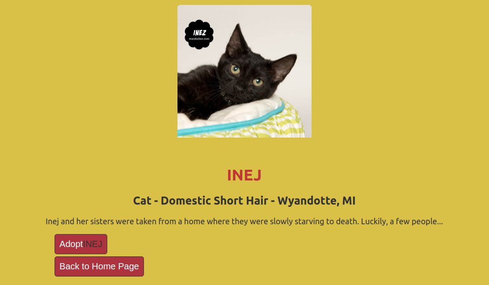
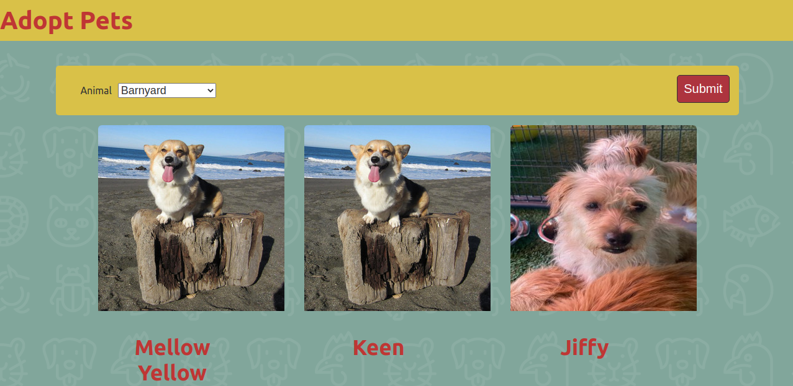

# catalogue-of-Pets
Building a single page application(SPA) that has two pages i.e list of pets and details about specific pet i.e Name, Breed, Location, and Description. User can filter through the list by animal type, gender and size, and select favorite Pet to Adopt. 

I acquired the [petFinder API](https://www.npmjs.com/package/@petfinder/petfinder-js) and [Front-end Master's [pet API](https://www.npmjs.com/package/@frontendmasters/pet) through npm and for the API Keys through the petFinder [documentation](https://www.petfinder.com/developers/v2/docs/) where one can request for API key and secret key.





## Built With

- petFinder API
- Pet API by Front-End Masters
- React
- Redux Toolkit

## Getting Started

### Prerequisites

To get this project up and running locally, you must already have npm and nodejs plus the necessary packages installed on your computer

**simple steps set up on your local machine**

```
- $ git clone `$ git clone https://github.com/jebitok-dev/catalogue-of-pets`
- $ git checkout develop
- Run `cd catalogue-of-pets`
- ``$ npm install`` or ``$ yarn install``
- ``$ npm start``
```

- [Live Version](https://catalogue-of-pets.netlify.app/)
- [React-Part Video](https://www.loom.com/share/90e8c180e034429aa44677fd5dbb941b)
- [Redux/ React-Redux Part Video](https://www.loom.com/share/bb9dd88c7443446b934fb9f1bc51648a)
- [Live Version Video](https://www.loom.com/share/9411e08943f943b6b45ad282d69dca24)

### Run Tests
 Tests for modules written using **Jest** and **React Testing Library**
- ``$ npm run test`` or ``$ yarn test``

## Author

👤 **Sharon Jebitok**

- Github: [jebitok-dev](https://github.com/jebitok-dev)
- Twitter: [@jsebitok](https://twitter.com/jsebitok) | [@SharonJebitok](https://twitter.com/SharonJebitok) 
- LinkedIn: [Sharon Jebitok](https://www.linkedin.com/in/sharon-jebitok/)

## 🤝 Contributing

Contributions, issues and feature requests are always welcome!

I love meeting other developers, especially ones that give me advice on how to improve my work.

Feel free to check the [issues page](https://github.com/jebitok-dev/catalogue-of-pets).

### How to Contribute

To get a local copy up and running follow these simple example steps.

```
- Fork the repository
- git clone https://github.com/your_username/catalogue-of-pets
- git checkout develop
- git checkout -b branch name
- git remote add upstream https://github.com/jebitok-dev/catalogue-of-pets
- git pull upstream develop
- git commit -m "commit message"
- git push -u origin HEAD
```

## Show your support

Finally, if you've read this far, don't forget to give this repo a ⭐️. They're free . . . I think.

## Acknowledgments

- [Microverse](https://microverse.org) for project specifications.
- [Marc-Antoine Roy](https://www.behance.net/gallery/11351281/NomNom) for his Recipe Design on Behance that will be using as inspiration for implementing the project.
